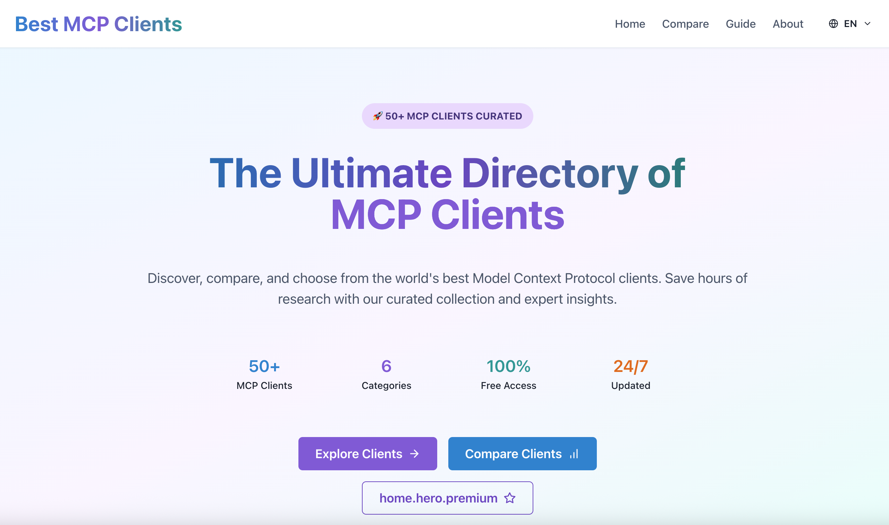

# Best MCP Clients

A curated list of the best Model Context Protocol (MCP) clients available across different platforms and use cases.

## About MCP

The Model Context Protocol (MCP) is a standardized way for AI assistants to connect with external tools and data sources. This repository maintains a comprehensive list of MCP-compatible clients to help developers and users find the right tools for their needs.

**🌐 Website:** All MCP clients listed here are also featured on our companion website at [bestmcpclients.com](https://www.bestmcpclients.com/) for easy browsing and discovery.



## Categories

- [Desktop Applications](#desktop-applications)
- [Development Environment Clients](#development-environment-clients)
- [Web-Based and Chat Clients](#web-based-and-chat-clients)
- [Terminal and CLI Clients](#terminal-and-cli-clients)
- [Specialized and Framework Clients](#specialized-and-framework-clients)
- [China-Specific MCP Clients](#china-specific-mcp-clients)

## Desktop Applications

### 5ire


A cross-platform desktop AI assistant and MCP client supporting multiple service providers and local tools.

**Platforms:** macOS, Windows, Linux  
**Official Site:** https://5ire.app

---

### BoltAI


A native, all-in-one AI chat client with MCP support, compatible with various LLM providers and local models.

**Platforms:** macOS  
**Official Site:** https://boltai.com

---

### Cherry Studio


A desktop application with MCP support, popular in China and integrated with Alibaba Cloud.

**Platforms:** macOS, Windows, Linux  
**Official Site:** https://github.com/kangfenmao/cherry-studio

---

### Claude Desktop


Anthropic's official desktop application offering full MCP integration for resources, prompts, and tools.

**Platforms:** macOS, Windows  
**Official Site:** https://claude.ai/download

---

### eechat


An open-source, cross-platform desktop app with full MCP support and multilingual interface.

**Platforms:** macOS, Windows, Linux  
**Official Site:** https://www.ee.chat/

---

### HyperChat


A chat client focused on openness, using various LLM APIs and productivity tools via MCP. Still in demo stage.

**Platforms:** Demo Stage  
**Official Site:** https://hyperchat.ai

---

### Msty Studio


A desktop application featuring MCP client capabilities for AI-powered workflows.

**Platforms:** macOS, Windows, Linux  
**Official Site:** https://msty.app

---

### Tome


A desktop app supporting MCP integration for enhanced AI chat experiences.

**Platforms:** macOS, Windows  
**Official Site:** https://tome.app

## Development Environment Clients

### Claude Code


Anthropic's interactive agentic coding tool with built-in MCP integration for prompts and tools.

**Platforms:** CLI  
**Official Site:** https://claude.ai/code

---

### Cline


An autonomous coding agent for IDEs, capable of file operations and command execution with MCP support.

**Platforms:** VS Code Extension  
**Official Site:** https://github.com/cline/cline

---

### Continue


An open-source IDE extension for custom AI code assistants, supporting MCP clients.

**Platforms:** VS Code Extension, JetBrains Extension  
**Official Site:** https://continue.dev

---

### Copilot-MCP


An MCP integration layer for GitHub Copilot, enabling advanced tool invocation.

**Platforms:** GitHub Copilot Extension  
**Official Site:** https://github.com/copilot-extensions/copilot-mcp

---

### Cursor


A popular AI-powered code editor with real-time MCP client support for tool invocation.

**Platforms:** macOS, Windows, Linux  
**Official Site:** https://cursor.sh

---

### Emacs Mcp


An Emacs extension that interfaces with MCP servers for AI-powered development.

**Platforms:** Emacs Extension  
**Official Site:** https://github.com/emacs-mcp/emacs-mcp

---

### Roo Code


A code editor plugin providing a team of AI agents with MCP support.

**Platforms:** VS Code Extension  
**Official Site:** https://roo.codeium.com

---

### Sourcegraph Cody


A code intelligence platform with MCP client capabilities for enhanced code search and navigation.

**Platforms:** VS Code Extension, JetBrains Extension, Web  
**Official Site:** https://sourcegraph.com/cody

---

### VS Code GitHub Copilot


A Visual Studio Code extension with MCP integration for advanced AI-powered coding.

**Platforms:** VS Code Extension  
**Official Site:** https://marketplace.visualstudio.com/items?itemName=GitHub.copilot

---

### Windsurf Editor


A code editor supporting MCP client features for improved developer workflows.

**Platforms:** macOS, Windows, Linux  
**Official Site:** https://codeium.com/windsurf

---

### Zed


A high-performance, multiplayer code editor with built-in MCP support.

**Platforms:** macOS, Linux  
**Official Site:** https://zed.dev

## Web-Based and Chat Clients

### ChatMCP


A web-based AI chat client specifically implementing the Model Context Protocol.

**Platforms:** Web  
**Official Site:** https://github.com/modelcontextprotocol/chatmcp

---

### DeepChat


A browser-based chat interface with full MCP support for AI interactions.

**Platforms:** Web  
**Official Site:** https://deepchat.dev

---

### LibreChat


An open-source chat platform with integrated MCP capabilities.

**Platforms:** Web, Self-hosted  
**Official Site:** https://librechat.ai

---

### NextChat


A web-based chat client supporting MCP for seamless AI tool access.

**Platforms:** Web, Self-hosted  
**Official Site:** https://nextchat.dev

---

### Y Gui


A graphical web interface for AI chat, supporting MCP server connections.

**Platforms:** Web  
**Official Site:** https://github.com/yjs/y-gui

## Terminal and CLI Clients

### console-chat-gpt


A console-based chat interface with MCP protocol support.

**Platforms:** CLI, macOS, Windows, Linux  
**Official Site:** https://github.com/platelminto/console-chat-gpt

---

### MCP CLI client


A command-line interface for interacting with MCP servers and tools.

**Platforms:** CLI, macOS, Windows, Linux  
**Official Site:** https://github.com/modelcontextprotocol/cli

---

### oterm


A terminal-based MCP client for streamlined AI interactions in the shell.

**Platforms:** CLI, macOS, Windows, Linux  
**Official Site:** https://github.com/ggozad/oterm

---

### y-cli


A lightweight terminal chat app for AI models with MCP client support.

**Platforms:** CLI, macOS, Windows, Linux  
**Official Site:** https://github.com/yjs/y-cli

## Specialized and Framework Clients

### AgentAI


An AI agent platform with integrated MCP support for multi-agent workflows.

**Platforms:** Web, API  
**Official Site:** https://agentai.dev

---

### fast-agent


A Python agent framework with declarative MCP support for rapid development.

**Platforms:** Python Framework  
**Official Site:** https://github.com/jxnl/fast-agent

---

### Genkit


Google's AI development kit featuring MCP integration for tool orchestration.

**Platforms:** Node.js Framework, Go Framework  
**Official Site:** https://firebase.google.com/docs/genkit

---

### Goose


An AI assistant platform with MCP client features for enterprise use.

**Platforms:** Python Framework  
**Official Site:** https://github.com/square/goose

---

### NVIDIA Agent Intelligence (AIQ) toolkit


NVIDIA's toolkit for AI development, now supporting MCP for data and tool access.

**Platforms:** Python Framework, CUDA  
**Official Site:** https://developer.nvidia.com/agent-intelligence

---

### Microsoft Copilot Studio


Microsoft's AI development platform with MCP integration for enterprise solutions.

**Platforms:** Web, Microsoft 365  
**Official Site:** https://copilotstudio.microsoft.com

## China-Specific MCP Clients

### Alibaba Cloud MCP integrations


Alibaba Cloud's suite of MCP integrations, optimized for the Chinese market and local regulations.

**Platforms:** Web, Cloud API  
**Official Site:** https://www.alibabacloud.com/product/ai

---

### Tencent MCP solutions


Tencent's MCP-enabled services, designed for compliance and domestic LLM providers.

**Platforms:** Web, Cloud API  
**Official Site:** https://cloud.tencent.com/product/ai

---

### Dify


A Chinese AI platform with MCP support, featured in Alibaba's integration practices.

**Platforms:** Web, Self-hosted, Cloud API  
**Official Site:** https://dify.ai

---

### Baidu Map MCP integrations


Baidu Map's MCP integration, the first map service in China to support the protocol.

**Platforms:** Web, Mobile API  
**Official Site:** https://lbsyun.baidu.com

---

### China Weather MCP Server client integrations


MCP clients for accessing weather data in Chinese cities using AMap Weather API.

**Platforms:** API, Python Framework  
**Official Site:** https://lbs.amap.com/api/webservice/guide/api/weatherinfo

---

### Hot Topic Aggregator


A Python-based MCP client collecting trending topics from Chinese social platforms like Weibo and Zhihu.

**Platforms:** Python Framework  
**Official Site:** https://github.com/hot-topic-aggregator/mcp-client

## Contributing

We welcome contributions to this list! To add your MCP client:

### Submission Guidelines

1. **Fork this repository**
2. **Add your client** to the appropriate category in this README
3. **Follow the format** shown above with these required fields:
   - **Name**: The name of your MCP client
   - **Logo**: Add your logo to the `logos/` directory and reference it
   - **Description**: A brief introduction (1-2 sentences)
   - **Platforms**: Supported platforms/environments
   - **Official Site**: Link to your official website or repository

### Format Template

```markdown
### Your Client Name


A brief description of what your MCP client does and its key features.

**Platforms:** Platform1, Platform2, Platform3  
**Official Site:** https://your-website.com
```

### Logo Requirements

- File format: PNG, SVG, ICO, or WebP
- Place in the `logos/` directory
- Use clear, professional logos

### Review Process

- All submissions will be reviewed for quality and MCP compliance
- We may ask for additional information or clarification
- Clients must have working MCP implementation

## License

This project is licensed under the Apache 2.0 License - see the [LICENSE](LICENSE) file for details.

## Acknowledgments

Special thanks to all the developers and organizations building MCP-compatible tools and advancing the Model Context Protocol ecosystem.
